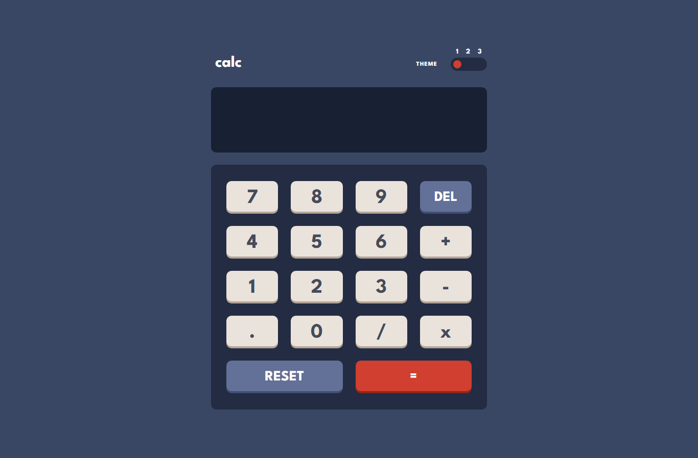
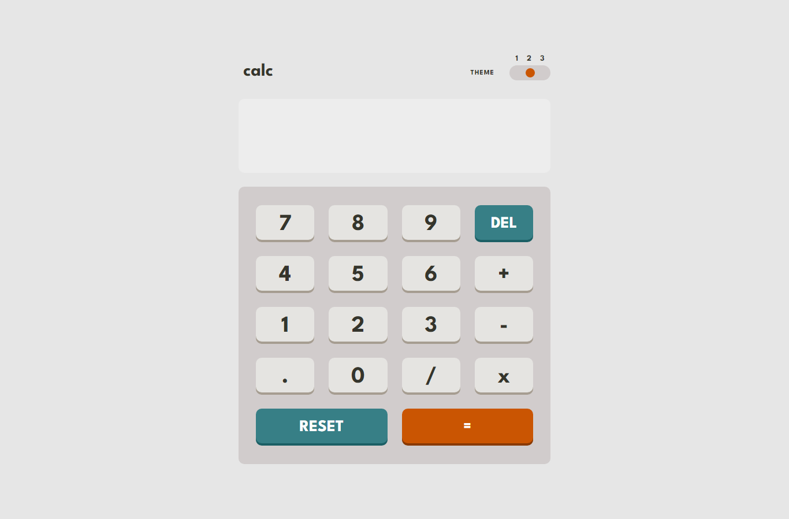
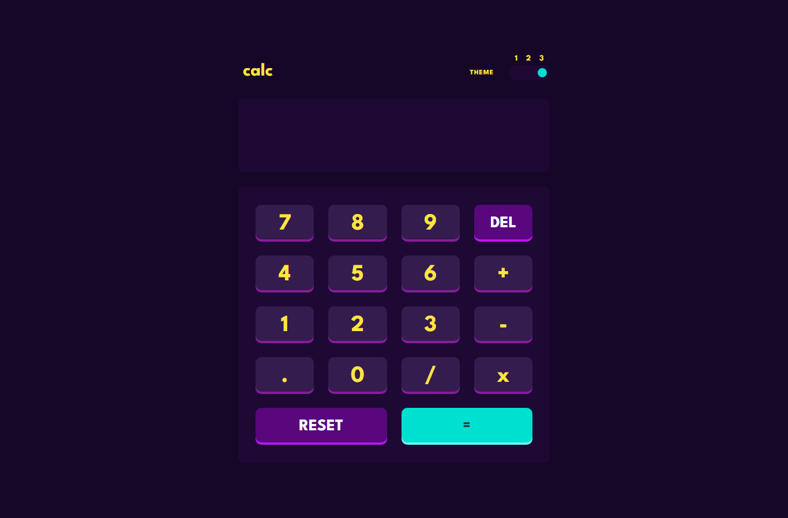
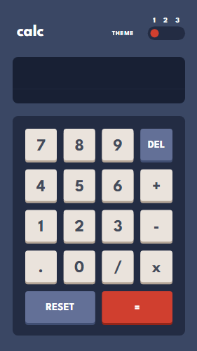
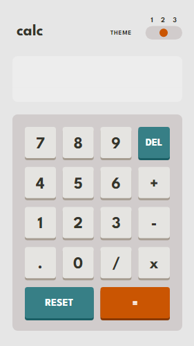
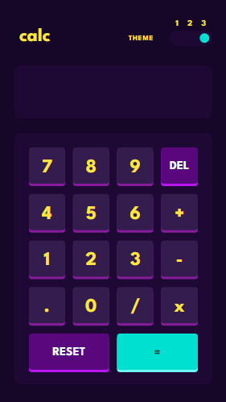

# Frontend Mentor - Calculator app solution

This is a solution to the [Calculator app challenge on Frontend Mentor](https://www.frontendmentor.io/challenges/calculator-app-9lteq5N29). Frontend Mentor challenges help you improve your coding skills by building realistic projects.

## Table of contents

- [Overview](#overview)
  - [The challenge](#the-challenge)
  - [Screenshot](#screenshot)
  - [Links](#links)
- [My process](#my-process)
  - [Built with](#built-with)
  - [What I learned](#what-i-learned)
  - [Continued development](#continued-development)
  - [Useful resources](#useful-resources)
- [Author](#author)
- [Acknowledgments](#acknowledgments)

## Overview
In search for resources to better my front-end Journey, I discovered an amazing site that provides front-end developers with design files to replicate. This is one of the many solutions I have submitted so far. Do give me your feedbacks on how I can improve.

### The challenge

Users should be able to:

- See the size of the elements adjust based on their device's screen size
- Perform mathmatical operations like addition, subtraction, multiplication, and division
- Adjust the color theme based on their preference
- **Bonus**: Have their initial theme preference checked using `prefers-color-scheme` and have any additional changes saved in the browser

### Screenshot

### Links

- Solution URL: [Calculator App](https://www.frontendmentor.io/challenges/nft-preview-card-component-SbdUL_w0U/hub/responsive-nft-product-preview-card-using-css-flex-box-88Fo1Ar5jY)
- Live Site URL: [Calculator App](https://source-web.github.io/calculator-main-app/)

## My process

- The project details and files were gotten from [Front-end Mentor](https://www.frontendmentor.io)
- I read the README file before starting the project, there I got directives on how to work out the challange.
- Afterwards, I wrote the HTML first then created a separate style sheet for my CSS.
- I used Figma to get the best judgement for margins, paddings and width.
- I used CSS media query to make it responsive.
- Then added JavaScript for Functionality

### Built with

- Semantic HTML5 markup
- CSS custom properties
- Flexbox
- CSS Grid
- CSS Media Queries
- Plain JavaScript

### What I learned

From this project and many other projects I've completed, I've been continually learing the best approach to reproducing a UI/UX design and how to better handle a project.

### Continued development

In future projects, I want to be able to combine my HTML and CSS knowledge with JavaScript to be able to build a flexible, responsive, functional and interactive websites, landing pages, blogs and a Portfolio for myself.

### Useful resources

- [Figma.com](https://figma.com) - This helped me to get the best judgement for font-size, margin, padding, width and border-radius. I really liked this pattern and will use it going forward.

## Author

- Github - [Nwali Joseph](https://github.com/Source-Web)
- Frontend Mentor - [@Source-Web](https://www.frontendmentor.io/profile/Source-Web)
- Facebook - [@joseph.nwali.5249](https://www.facebook.com/joseph.nwali.5249)

## Acknowledgments

I want to thank front-end Mentor for this design challenge. My front-end journey has been a smooth one with you.

I also appreciate Github pages for allowing me host this challange for free.
